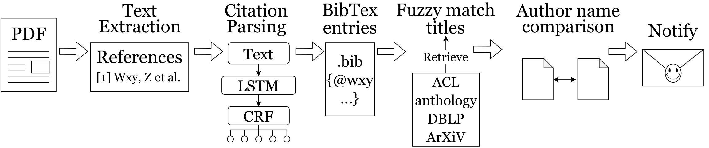
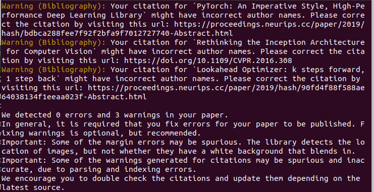

# ACL pubcheck
ACL pubcheck is a Python tool that automatically detects font errors, author formatting errors, margin violations, outdated citations as well as many other common formatting errors in papers that are using the LaTeX sty file associated with ACL venues. The script can be used to check your papers before you submit to a conference. (We highly recommend running ACL pubcheck on your papers *pre-submission*&mdash;a well formatted paper helps keep the reviewers focused on the scientific content.) However, its main purpose is to ensure your accepted paper is properly formatted, i.e., it follows the venue's style guidelines. The script is used by the publication chairs at most ACL events to check for formatting issues. Indeed, running this script yourself and fixing errors before uploading the camera-ready version of your paper will often save you a personalized email from the publication chairs. 

You can install the package by cloning the repo
1. ``git clone git@github.com:acl-org/aclpubcheck.git`` or ``git clone https://github.com/acl-org/aclpubcheck.git``
2. ``cd aclpubcheck``
3. ``pip install -e .``

You can run the script on a paper as follows
``python3 aclpubcheck/formatchecker.py --paper_type PAPER_TYPE PAPER_NAME.pdf`` where ``PAPER_TYPE`` is taken from the set {long,short,other}. You should choose either long or short depending on the type of paper you have accepted.

If you find that ACL pubcheck gives you a margin error due to a figure that runs into the margin, you can often fix the problem by applying the [adjustbox package](https://ctan.org/pkg/adjustbox?lang=en). Additionally, if the margin error is caused by an equation, then it may help to break the equation over two lines.

**Note**: Additional info can be found in the PDF document ``aclpubcheck_additional_info.pdf`` included in this package.

**Online Version**: If you are having trouble with installing and using the Python toolkit directly, you can use a CodaLab version online https://colab.research.google.com/drive/1Sq6ilmrFUQpUFMkV71U8-Wf0madW-Uer?usp=sharing. 

## Updating the names in citations

### Description

Our toolkit now automatically checks your citations and will leave a warning if you have used incorrect names or author list. Please have a look [here](https://2021.naacl.org/blog/name-change-procedure/) on why it is important to use updated citations.

Demo version of PDF name checking is available [here](https://pdf-name-change-checking.herokuapp.com/).

### How it's done

The bibilography from your PDF file is extracted using [Scholarcy API](https://ref.scholarcy.com/api/). Each bib entry in this bib file is updated by pulling information from ACL anthology, DBLP and arXiv; by using fuzzy match of the titles. After updating the bibs, the author names are compared and mismatches in author names are warned.

### Functionality

The functions are present in `aclpubcheck/name_check.py`. The class `PDFNameCheck` is used in `formatchecker.py`.

### Caveats

Some of the warnings generated for citations may be spurious and inaccurate, due to parsing and indexing errors. We encourage you to double check the citations and update them depending on the latest source. If you believe that your citation is updated and correct, then please ignore those warnings. You can fix your bib files using the toolkit like [rebiber](https://github.com/yuchenlin/rebiber).

### Screenshots

This is how the warnings appear for the outdated names. You would be directed to a URL where you can correct the citations. We are not showing the name changes as it might out the deadnames in the warnings.

## Credits
The original version of ACL pubcheck was written by Yichao Zhou, Iz Beltagy, Steven Bethard, Ryan Cotterell and Tanmoy Chakraborty in their role as publications chairs of [NAACL 2021](https://2021.naacl.org/organization/). The tool was improved by Ryan Cotterell and Danilo Croce in their role as publication chairs of [ACL 2022](https://www.2022.aclweb.org/organisers) and [NAACL 2022](https://2022.naacl.org/). Pranav A added the name checking functions to this toolkit.
