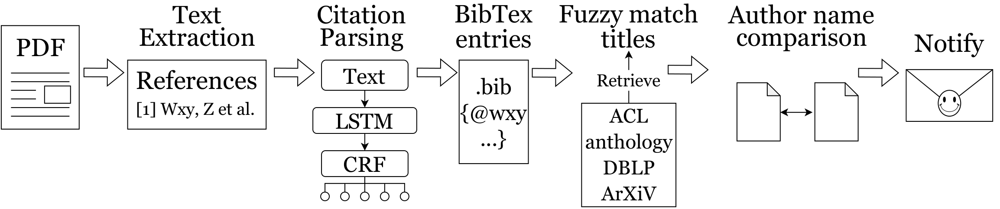
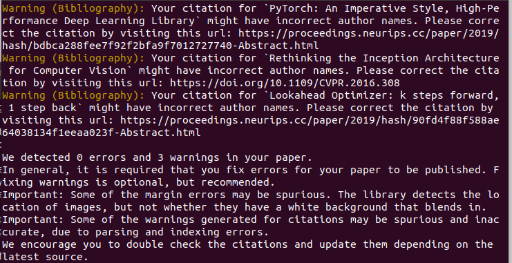

# ACL pubcheck

ACL pubcheck automatically detects common formatting problems in papers using the LaTeX style files for ACL venues, including font errors, author formatting errors, margin violations, outdated citations, and other issues.

If you are preparing a paper for an ACL venue, we strongly recommend running ACL pubcheck before submission and again before uploading the camera-ready version. Fixing formatting problems in advance helps both authors and publication chairs.

## Check your paper

### Online — no installation required

If you just want to check a paper, the easiest way to get started is to use one of the online versions:

- **[Google Colab](https://colab.research.google.com/github/acl-org/aclpubcheck/blob/main/aclpubcheck_online.ipynb)** — upload your PDF and run ACL pubcheck directly in your browser. No local installation is required. (Thanks to Danilo Croce.)
- **[Hugging Face Space](https://huggingface.co/spaces/teelinsan/aclpubcheck)** — a web interface for running ACL pubcheck. (Thanks to Andrea Santilli; source and additional information are available at https://github.com/teelinsan/aclpubcheck-gui.)

ACL pubcheck is intended for the **camera-ready version** of the paper when checking final formatting. Running it on an anonymous or line-numbered review version may produce spurious margin errors because of line numbers.

### Run locally

For repeated use, batch checking, or publication-chair workflows, you can run ACL pubcheck locally.

ACL pubcheck requires **Python 3.10 or newer**.

ACL pubcheck depends on [rebiber](https://github.com/yuchenlin/rebiber), which is installed from a pinned GitHub commit for reproducibility.

The simplest local option is [`uv`](https://docs.astral.sh/uv/). After [installing `uv`](https://docs.astral.sh/uv/getting-started/installation/), you can run ACL pubcheck without installing it permanently:

```bash
uvx --from git+https://github.com/acl-org/aclpubcheck \
    aclpubcheck --paper_type PAPER_TYPE /path/to/paper.pdf
```

Replace `PAPER_TYPE` with `long`, `short`, or `demo`.

You can also install ACL pubcheck directly from GitHub using `pip`:

```bash
pip3 install git+https://github.com/acl-org/aclpubcheck
```

and then run:

```bash
aclpubcheck --paper_type PAPER_TYPE path/to/paper.pdf
```

or:

```bash
python3 -m aclpubcheck --paper_type PAPER_TYPE path/to/paper.pdf
```

For example:

```bash
python3 -m aclpubcheck -p long example/2023.acl-tutorials.1.pdf
```

### Install from source

If you want to develop or modify ACL pubcheck locally:

```bash
# clone using SSH
git clone git@github.com:acl-org/aclpubcheck.git

# or HTTPS
git clone https://github.com/acl-org/aclpubcheck.git

cd aclpubcheck
pip install -e .
```

## Reports

Each run writes a JSON report for every paper, plus annotated PNG pages for margin errors, to the current directory. The reports are named after the paper ID, which is the file name without `.pdf`, cut at the first underscore: `1234_paper.pdf` gives `errors-1234.json` and `errors-1234-page-N.png`. If several PDFs in one run share an ID (ignoring case), such as `1234_original.pdf` and `1234_corrected.pdf`, their reports are named after the file name without `.pdf` instead (`errors-1234_original.json` and `errors-1234_corrected.json`). If PDFs in different directories also share a file name, the first 8 hex digits of the SHA-256 hash of each PDF are appended (`errors-1234_paper_3f9a1c2e.json`). A later run overwrites reports with the same names but does not delete other files, so annotated pages from an earlier run can remain next to a newer JSON report.

To save the reports to another directory, which is created if needed, use `--output-dir` (or `-o`). To keep runs apart, use `--temp-output-dir`, which saves them to a new temporary directory. With either option, the directory is printed when the check starts and finishes.

```bash
aclpubcheck --paper_type PAPER_TYPE --output-dir path/to/reports path/to/paper.pdf
aclpubcheck --paper_type PAPER_TYPE --temp-output-dir path/to/paper.pdf
```

If you find that ACL pubcheck gives you a margin error due to a figure that runs into the margin, you can often fix the problem by applying the [adjustbox package](https://ctan.org/pkg/adjustbox?lang=en). Additionally, if the margin error is caused by an equation, then it may help to break the equation over two lines.

**Note**: Additional information can be found in `aclpubcheck_additional_info.pdf`, included in this repository.

## Page Numbering

Typically, the space at the bottom of a paper should be left empty, as page numbers will be added during the watermarking process of the proceedings. By default, ACL pubcheck ensures that a margin of approximately 2 cm at the bottom of each page is left blank. If any text is detected in this area, such as page numbers mistakenly added, a warning is generated. However, if this area must contain information, or if you need to bypass this check for any reason, you can disable it by using the parameter `--disable_bottom_check`.

## Updating the names in citations

### Description

Our toolkit now automatically checks your citations and will leave a warning if you have used incorrect author names or author lists. Please have a look [here](https://2021.naacl.org/blog/name-change-procedure/) on why it is important to use updated citations.

Demo version of PDF name checking is available [here](https://pdf-name-change-checking.herokuapp.com/).

### How it's done

The bibliography from your PDF file is extracted using the [Scholarcy API](https://ref.scholarcy.com/api/). Each bib entry in this bib file is updated by pulling information from ACL anthology, DBLP and arXiv; by using fuzzy match of the titles. After updating the bibs, the author names are compared and mismatches in author names are warned.



### Functionality

The functions are present in `aclpubcheck/name_check.py`. The class `PDFNameCheck` is used in `formatchecker.py`.

### Caveats

Some of the warnings generated for citations may be spurious and inaccurate, due to parsing and indexing errors. We encourage you to double check the citations and update them depending on the latest source. If you believe that your citation is updated and correct, then please ignore those warnings. You can fix your bib files using the toolkit like [rebiber](https://github.com/yuchenlin/rebiber).

### Screenshots

This is how the warnings appear for the outdated names. You would be directed to a URL where you can correct the citations. We are not showing the name changes, as doing so might reveal deadnames in the warnings.



## Credits
The original version of ACL pubcheck was written by Yichao Zhou, Iz Beltagy, Steven Bethard, Ryan Cotterell and Tanmoy Chakraborty in their role as publications chairs of [NAACL 2021](https://2021.naacl.org/organization/). The tool was improved by Ryan Cotterell and Danilo Croce in their role as publication chairs of [ACL 2022](https://www.2022.aclweb.org/organisers) and [NAACL 2022](https://2022.naacl.org/). Pranav A added the name checking functions to this toolkit.

## Maintenance 
The tool is primarily maintained by Ryan Cotterell and Danilo Croce. More volunteers are welcome!
